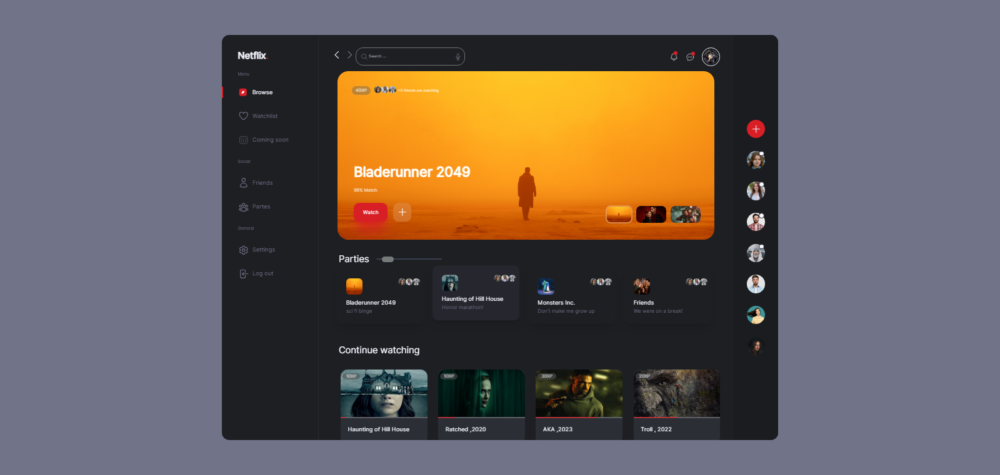

# new-netflix

## tools
Tailwind node modules:
```sh
npm install
```
nstall the plugin from npm:

```sh
npm i tailwindcss-animated
```
### use <a href="https://fonts.google.com/specimen/Inter?query=inter&preview.text=Mr.Root">Inter</a> font in project
### use <a href="https://swiperjs.com/">Swiper</a> Slider in project


## Preview
<<<<<<< HEAD

=======

>>>>>>> 5e994b69bfff06dfc19056fb3951a2f91b907130

*if you like it please give me a star, good luck*
